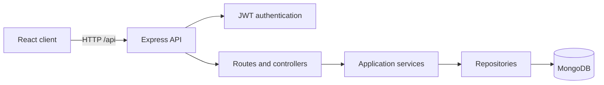

# SyncBoard

SyncBoard is a collaborative task board with a React client and an Express REST API. It supports MongoDB persistence, user registration, JWT-based login, protected routes, offline task caching, queued changes, and conflict resolution.

## Technology stack

- React 19 and React Router
- Vite
- Node.js and Express 5
- JSON Web Tokens and bcrypt
- Zod request validation
- MongoDB and Mongoose for persistence
- PouchDB for device-local caching and queued mutations

## Architecture



The client keeps HTTP access in `src/api`. The server separates routes, controllers, services, repositories, validation schemas, and middleware under `server/src`.

## Requirements

- Node.js 20.19 or newer
- A local MongoDB instance or MongoDB Atlas database
- npm 10 or newer

## Run locally

```bash
git clone https://github.com/Methul25/Full-stack-Group-Project.git
cd Full-stack-Group-Project
npm ci
```

Create a local `.env` from `.env.example`:

```bash
cp .env.example .env
```

On Windows PowerShell, use `Copy-Item .env.example .env` instead. Set `MONGODB_URI` to your MongoDB connection string and `JWT_SECRET` to a long random value, then start both applications:

```bash
npm run dev
```

The client runs at `http://localhost:5173` and proxies `/api` requests to the API at `http://localhost:4000`.

Demo data is disabled by default. To seed the two sample users and their tasks for a local demonstration, set `SEED_DEMO_DATA=true` and provide a private `SEED_USER_PASSWORD` of at least 8 characters in `.env`. Never commit that file or password.

### Local database options

- Local MongoDB: keep `MONGODB_URI=mongodb://127.0.0.1:27017/syncboard` and start the MongoDB service before `npm run dev`.
- MongoDB Atlas: replace `MONGODB_URI` with the application connection string from Atlas and add the developer's current IP address to the Atlas IP access list.

The API deliberately starts only after MongoDB connects. Successful startup prints both `MongoDB connected` and `SyncBoard listening on http://localhost:4000`. Check readiness at `http://localhost:4000/api/health`.

### Test the production server locally

Build once, then run Express in production mode. The production server hosts both the client and API at `http://localhost:4000`.

Windows PowerShell:

```powershell
npm run build
$env:NODE_ENV='production'
npm start
```

macOS or Linux:

```bash
npm run build
NODE_ENV=production npm start
```

Open `/login` directly and refresh it to verify the SPA fallback. Verify that `/api/does-not-exist` still returns a JSON 404.

## Deploy to Vercel

Production uses one Vercel project: Vite assets are served by Vercel and `/api` requests run Express through `api/index.js`. MongoDB Atlas stores persistent data. The browser uses same-origin `/api` requests, so no public `VITE_API_URL` is needed. Local development still runs Vite and Express together; `npm start` serves a local full-stack production build.

1. Create a MongoDB Atlas cluster and a dedicated database user with only the access this application needs.
2. Copy the Atlas driver connection string, including a database name such as `syncboard`. Percent-encode special characters in the database password.
3. Configure Atlas network access for the deployment. Prefer stable outbound addresses where your hosting plan supports them. `0.0.0.0/0` allows connection attempts from anywhere: use it only after accepting that exposure, with a strong unique password and a least-privilege database user. Restrict the user to the application's database, not all databases.
4. Push the reviewed branch to GitHub.
5. In Vercel, import the repository, select the reviewed release branch, keep the repository root, choose Vite, and select Node.js 22.x. The root `vercel.json` sets the install/build commands, output directory, API routing, SPA fallback, and security headers.
6. Add server-only environment variables: `NODE_ENV=production`, `MONGODB_URI`, a securely generated `JWT_SECRET` of at least 32 characters, `JWT_EXPIRES_IN=1h`, and `SEED_DEMO_DATA=false`. Never prefix secrets with `VITE_` or put them in Git. No `PORT` setting is needed for Vercel Functions. Use a separate database and secrets for preview deployments.
7. Deploy and wait for `https://<project>.vercel.app/api/health` to return `status: "ok"` and `database: "connected"`. Environment changes require a redeployment.
8. In a private browser, register, log out, log back in, complete task CRUD, refresh a nested route, and confirm data remains after a restart or redeploy.

Vercel Functions can cold-start and establish a fresh database connection. The first API request may be slower; open the application before a scheduled demonstration and avoid repeated registration submissions while a request is pending. The adapter reuses its connection promise within a warm instance. A successful frontend deployment alone does not establish that Atlas or authentication works.

### Vercel troubleshooting

- `Invalid environment configuration`: correct the named Vercel environment variable and redeploy.
- Health check remains 503: verify the Atlas URI, database user, password encoding, and Atlas IP access list.
- Login/register returns 404 HTML: confirm the request begins with `/api`, the deployment includes `api/index.js`, and API rewrites precede the SPA fallback.
- A nested URL returns 404: confirm the production build and `vercel.json` SPA rewrite are present.
- Rollback: restore a previous successful Vercel production deployment. Database changes are not rolled back by redeploying code. Inspect function logs without copying secrets into issues or chat.

## Environment variables

| Variable | Required | Purpose |
| --- | --- | --- |
| `NODE_ENV` | No | `development`, `test`, or `production`; defaults to development |
| `PORT` | No | Standalone API/listener port; defaults to 4000 locally; unused by Vercel Functions |
| `CLIENT_ORIGIN` | No | Exact allowed cross-origin client URL; defaults to the local Vite URL |
| `JWT_SECRET` | Yes | Private signing secret of at least 32 characters |
| `JWT_EXPIRES_IN` | No | Token duration such as `1h` or `7d` |
| `MONGODB_URI` | No locally, yes on Vercel | Local or Atlas MongoDB connection string |
| `SEED_DEMO_DATA` | No | Defaults to `false` |
| `SEED_USER_PASSWORD` | Only when seeding | Private demo-user password of at least 8 UTF-8 bytes |

## Security notes

Tokens remain in browser local storage to preserve the existing bearer-token and offline design. This makes XSS prevention important; production enables a restrictive Content Security Policy and does not render untrusted HTML. Logout removes the token and cached identity, but per-user PouchDB data remains on the device so queued offline work is not silently destroyed. Do not use a shared browser profile for sensitive boards.

## API contract

Successful responses use a `data` property. Collection responses also include `meta`. Errors use an `error` property containing a message, code, request ID, and optional validation details.

| Method | Endpoint | Authentication | Purpose |
| --- | --- | --- | --- |
| `GET` | `/api/health` | No | Check API health, uptime, and database connection |
| `POST` | `/api/auth/register` | No | Register a user and create a private board |
| `POST` | `/api/auth/login` | No | Authenticate and receive a JWT |
| `GET` | `/api/auth/me` | Bearer token | Restore the current user |
| `GET` | `/api/tasks/assignees` | Bearer token | List members of the default board |
| `GET` | `/api/tasks` | Bearer token | List and filter owned tasks |
| `GET` | `/api/tasks/analytics/overdue` | Bearer token | Aggregate overdue tasks by assignee |
| `GET` | `/api/tasks/:id` | Bearer token | Read an owned task |
| `POST` | `/api/tasks` | Bearer token | Create a task |
| `PATCH` | `/api/tasks/:id` | Bearer token | Update or move a task using `baseVersion` |
| `DELETE` | `/api/tasks/:id` | Bearer token | Delete a task |

## Validate a contribution

```bash
npm run lint
npm test
npm run build
npm audit --omit=dev
```

## Project structure

```text
src/
  api/          HTTP client modules
  components/   Reusable React components
  context/      Authentication and task state
  data/         Static client metadata
  hooks/        Reusable stateful logic
  pages/        Route-level components
  styles/       Shared styling
server/src/
  controllers/  HTTP request and response handling
  middleware/   Authentication, validation, and errors
  repositories/ Data access boundaries
  routes/       API route definitions
  schemas/      Zod request schemas
  services/     Authentication and task rules
```

## Data model and indexes

| Data | Storage | Reason |
| --- | --- | --- |
| Board columns | Embedded in boards | Bounded list, read and managed with its board |
| Board membership | Embedded user references and roles | Bounded board access list; users are shared across boards |
| Tasks | Separate collection referencing boards and assignees | Queried and updated independently; may grow without bound |
| Users | Separate collection | Shared identity, referenced by membership and task assignment |
| Activity | Separate collection referencing board, task and user | Append-only history grows independently |

Mongoose validates collection fields and supplies timestamps; task versions support optimistic concurrency. Task creation resolves the selected board member to `assigneeId`; `assignee` remains a display-name snapshot for the existing client and API. The name-based assignment API rejects ambiguous duplicate names within a board.

Indexes cover unique user email, board membership, task board/status/position, board/due date, assignee/status, task text search, and recent board activity.

## Offline use and conflicts

The browser caches tasks per user in PouchDB and stores pending mutations in an outbox. After an initial online visit, the production service worker caches the application shell for offline reloads. Queued changes replay when the connection returns.

Updates include `baseVersion`. A stale write returns `409 VERSION_CONFLICT` with the current task. Non-overlapping changes merge automatically; overlapping changes show a choice between the server version and the local edit.

Offline access requires a previously cached session and board. Clearing browser storage removes cached tasks and pending edits. The API must be available for registration and initial login.

## API verification

Import `SyncBoard_Assignment_03_Postman_Collection.json` into Postman. Set `baseUrl` and a private `seedPassword` environment variable matching `SEED_USER_PASSWORD`. Enable demo seeding on an empty database to create `maya@syncboard.test` and `noah@syncboard.test`. Do not export populated credentials or tokens.

The collection checks health, task CRUD, version conflicts, validation and overdue aggregation. To check persistence, restart the API and confirm previously created tasks remain. For offline verification, run the production build, disconnect the browser, create/update/delete tasks, reconnect and confirm replay. Use two sessions editing the same task to exercise both conflict choices.

## Known limitations

- Automated tests use an isolated in-memory MongoDB instance, never the developer database. CI checks lint, tests, build, and high/critical production advisories. Full browser/offline and live deployment acceptance still require manual verification.
- Authentication rate limits are process-local and reset across serverless instances; distributed abuse protection is required before a broadly exposed production rollout.
- JWTs and offline caches remain device-local; use separate browser profiles on shared devices. Duplicate registration responses can reveal account existence.
- Real-time WebSocket updates are not implemented yet.
- Docker packaging is not implemented. Deployment configuration is provided, but no public deployment is verified merely by this README.

See [CONTRIBUTING.md](CONTRIBUTING.md) before starting a branch or opening a pull request.
