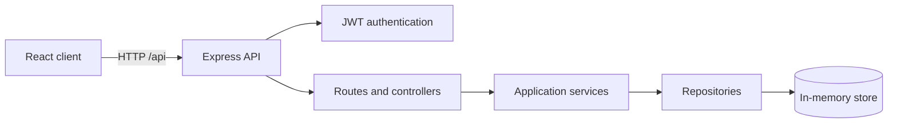

# SyncBoard

SyncBoard is a collaborative task board with a React client and an Express REST API. The current milestone supports user registration, JWT-based login, protected routes, and task creation, viewing, filtering, updating, moving, and deletion.

## Technology stack

- React 19 and React Router
- Vite
- Node.js and Express 5
- JSON Web Tokens and bcrypt
- Zod request validation
- In-memory repositories for the current milestone

## Architecture



The client keeps HTTP access in `src/api`. The server separates routes, controllers, services, repositories, validation schemas, and middleware under `server/src`.

## Requirements

- Node.js 20 or newer
- npm 10 or newer

## Run locally

```bash
git clone https://github.com/Methul25/Full-stack-Group-Project.git
cd Full-stack-Group-Project
npm install
```

Create a local `.env` from `.env.example`:

```bash
cp .env.example .env
```

On Windows PowerShell, use `Copy-Item .env.example .env` instead. Replace `JWT_SECRET` with a long random value, then start both applications:

```bash
npm run dev
```

The client runs at `http://localhost:5173` and proxies `/api` requests to the API at `http://localhost:4000`.

Demo data is disabled by default. To seed the two sample users and their tasks for a local demonstration, set `SEED_DEMO_DATA=true` and provide a private `SEED_USER_PASSWORD` in `.env`. Never commit that file or password.

## API contract

Successful responses use a `data` property. Collection responses also include `meta`. Errors use an `error` property containing a message, code, request ID, and optional validation details.

| Method | Endpoint | Authentication | Purpose |
| --- | --- | --- | --- |
| `GET` | `/api/health` | No | Check API health and uptime |
| `POST` | `/api/auth/register` | No | Register a user and create a private board |
| `POST` | `/api/auth/login` | No | Authenticate and receive a JWT |
| `GET` | `/api/auth/me` | Bearer token | Restore the current user |
| `GET` | `/api/tasks` | Bearer token | List and filter owned tasks |
| `GET` | `/api/tasks/:id` | Bearer token | Read an owned task |
| `POST` | `/api/tasks` | Bearer token | Create a task |
| `PATCH` | `/api/tasks/:id` | Bearer token | Update or move a task |
| `DELETE` | `/api/tasks/:id` | Bearer token | Delete a task |

## Validate a contribution

```bash
npm run lint
npm run build
```

## Project structure

```text
src/
  api/          HTTP client modules
  components/   Reusable React components
  context/      Authentication and task state
  data/         Static client metadata
  hooks/        Reusable stateful logic
  pages/        Route-level components
  styles/       Shared styling
server/src/
  controllers/  HTTP request and response handling
  middleware/   Authentication, validation, and errors
  repositories/ Data access boundaries
  routes/       API route definitions
  schemas/      Zod request schemas
  services/     Authentication and task rules
```

## Known limitations

- Data is held in memory and resets whenever the API restarts.
- MongoDB persistence and offline client caching are not implemented yet.
- Automated client/server tests and CI are not implemented yet.
- Real-time WebSocket updates and conflict detection are not implemented yet.
- Docker packaging and public deployment are not implemented yet.

See [CONTRIBUTING.md](CONTRIBUTING.md) before starting a branch or opening a pull request.
