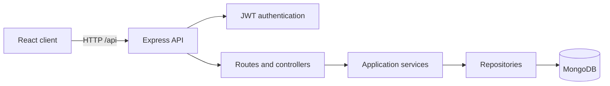

# SyncBoard

SyncBoard is a collaborative task board with a React client and an Express REST API. It supports MongoDB persistence, user registration, JWT-based login, protected routes, offline task caching, queued changes, and conflict resolution.

## Technology stack

- React 19 and React Router
- Vite
- Node.js and Express 5
- JSON Web Tokens and bcrypt
- Zod request validation
- MongoDB and Mongoose for persistence
- PouchDB for device-local caching and queued mutations

## Architecture



The client keeps HTTP access in `src/api`. The server separates routes, controllers, services, repositories, validation schemas, and middleware under `server/src`.

## Requirements

- Node.js 20.19 or newer
- A local MongoDB instance or MongoDB Atlas database
- npm 10 or newer

## Run locally

```bash
git clone https://github.com/Methul25/Full-stack-Group-Project.git
cd Full-stack-Group-Project
npm install
```

Create a local `.env` from `.env.example`:

```bash
cp .env.example .env
```

On Windows PowerShell, use `Copy-Item .env.example .env` instead. Set `MONGODB_URI` to your MongoDB connection string and `JWT_SECRET` to a long random value, then start both applications:

```bash
npm run dev
```

The client runs at `http://localhost:5173` and proxies `/api` requests to the API at `http://localhost:4000`.

Demo data is disabled by default. To seed the two sample users and their tasks for a local demonstration, set `SEED_DEMO_DATA=true` and provide a private `SEED_USER_PASSWORD` of at least 8 characters in `.env`. Never commit that file or password.

## API contract

Successful responses use a `data` property. Collection responses also include `meta`. Errors use an `error` property containing a message, code, request ID, and optional validation details.

| Method | Endpoint | Authentication | Purpose |
| --- | --- | --- | --- |
| `GET` | `/api/health` | No | Check API health, uptime, and database connection |
| `POST` | `/api/auth/register` | No | Register a user and create a private board |
| `POST` | `/api/auth/login` | No | Authenticate and receive a JWT |
| `GET` | `/api/auth/me` | Bearer token | Restore the current user |
| `GET` | `/api/tasks/assignees` | Bearer token | List members of the default board |
| `GET` | `/api/tasks` | Bearer token | List and filter owned tasks |
| `GET` | `/api/tasks/analytics/overdue` | Bearer token | Aggregate overdue tasks by assignee |
| `GET` | `/api/tasks/:id` | Bearer token | Read an owned task |
| `POST` | `/api/tasks` | Bearer token | Create a task |
| `PATCH` | `/api/tasks/:id` | Bearer token | Update or move a task using `baseVersion` |
| `DELETE` | `/api/tasks/:id` | Bearer token | Delete a task |

## Validate a contribution

```bash
npm run lint
npm run build
```

## Project structure

```text
src/
  api/          HTTP client modules
  components/   Reusable React components
  context/      Authentication and task state
  data/         Static client metadata
  hooks/        Reusable stateful logic
  pages/        Route-level components
  styles/       Shared styling
server/src/
  controllers/  HTTP request and response handling
  middleware/   Authentication, validation, and errors
  repositories/ Data access boundaries
  routes/       API route definitions
  schemas/      Zod request schemas
  services/     Authentication and task rules
```

## Data model and indexes

| Data | Storage | Reason |
| --- | --- | --- |
| Board columns | Embedded in boards | Bounded list, read and managed with its board |
| Board membership | Embedded user references and roles | Bounded board access list; users are shared across boards |
| Tasks | Separate collection referencing boards and assignees | Queried and updated independently; may grow without bound |
| Users | Separate collection | Shared identity, referenced by membership and task assignment |
| Activity | Separate collection referencing board, task and user | Append-only history grows independently |

Mongoose validates collection fields and supplies timestamps; task versions support optimistic concurrency. Task creation resolves the selected board member to `assigneeId`; `assignee` remains a display-name snapshot for the existing client and API. The name-based assignment API rejects ambiguous duplicate names within a board.

Indexes cover unique user email, board membership, task board/status/position, board/due date, assignee/status, task text search, and recent board activity.

## Offline use and conflicts

The browser caches tasks per user in PouchDB and stores pending mutations in an outbox. After an initial online visit, the production service worker caches the application shell for offline reloads. Queued changes replay when the connection returns.

Updates include `baseVersion`. A stale write returns `409 VERSION_CONFLICT` with the current task. Non-overlapping changes merge automatically; overlapping changes show a choice between the server version and the local edit.

Offline access requires a previously cached session and board. Clearing browser storage removes cached tasks and pending edits. The API must be available for registration and initial login.

## API verification

Import `SyncBoard_Assignment_03_Postman_Collection.json` into Postman. Set `baseUrl` and a private `seedPassword` environment variable matching `SEED_USER_PASSWORD`. Enable demo seeding on an empty database to create `maya@syncboard.test` and `noah@syncboard.test`. Do not export populated credentials or tokens.

The collection checks health, task CRUD, version conflicts, validation and overdue aggregation. To check persistence, restart the API and confirm previously created tasks remain. For offline verification, run the production build, disconnect the browser, create/update/delete tasks, reconnect and confirm replay. Use two sessions editing the same task to exercise both conflict choices.

## Known limitations

- Automated client/server tests and CI are not implemented yet.
- Real-time WebSocket updates are not implemented yet.
- Docker packaging and public deployment are not implemented yet.

See [CONTRIBUTING.md](CONTRIBUTING.md) before starting a branch or opening a pull request.
